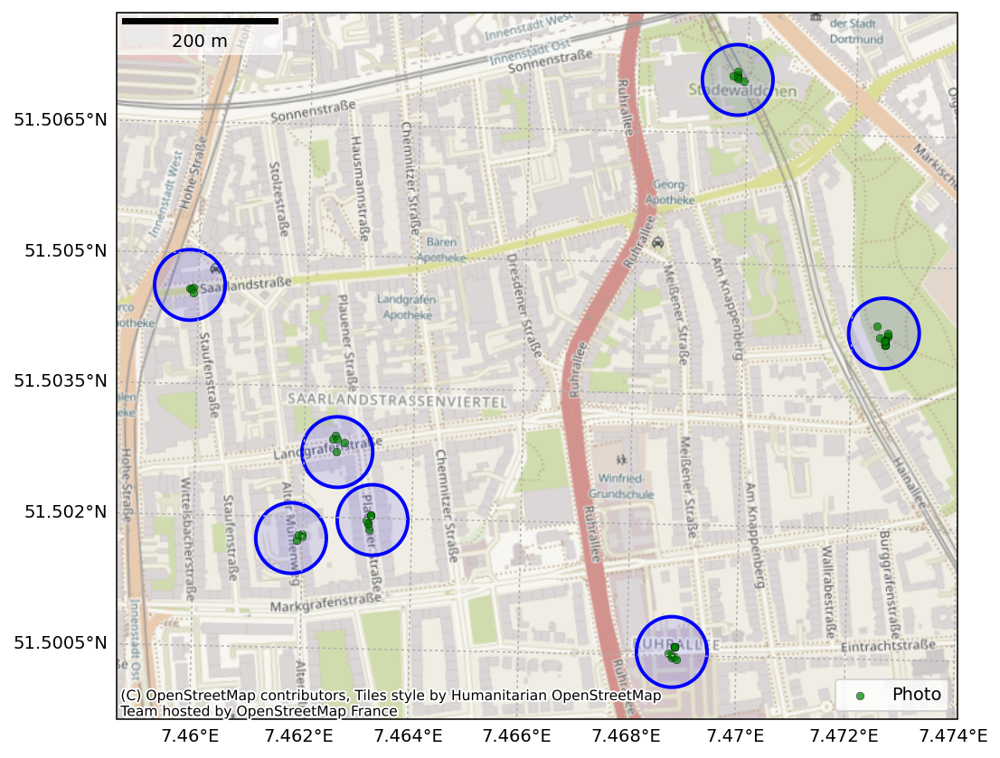

[](https://results.pre-commit.ci/latest/github/RUBclim/bike-pic-renamer/master)

# bike-pic-renamer

Automatically rename photos based on EXIF GPS data.



## installation

via https

```bash
pip install git+https://github.com/RUBclim/bike-pic-renamer
```

via ssh

```bash
pip install git+ssh://git@github.com/RUBclim/bike-pic-renamer
```

## usage

```console
usage: bike-pic-renamer [-h] [--output-dir OUTPUT_DIR] files [files ...]

Rename bike pictures based on nearest station and timestamp.

positional arguments:
  files                 The input images any number can be specified. It may be a glob pattern

options:
  -h, --help            show this help message and exit
  --output-dir OUTPUT_DIR
                        Directory to save the renamed images to
```

Rename a folder of files like this:

```bash
bike-pic-renamer images/202508* --output-dir my-new-directory
```

The directory is created and files are copied and renamed.
